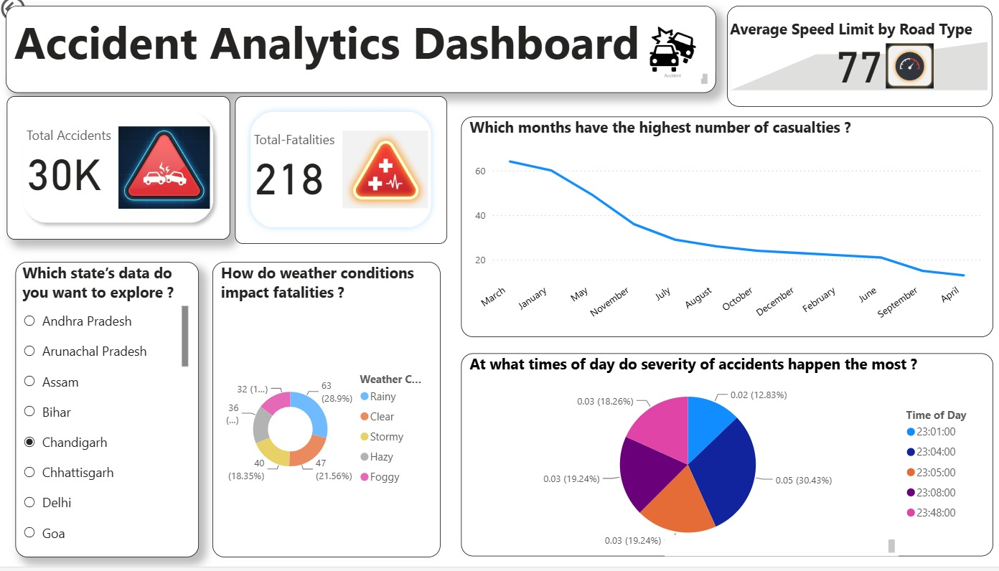
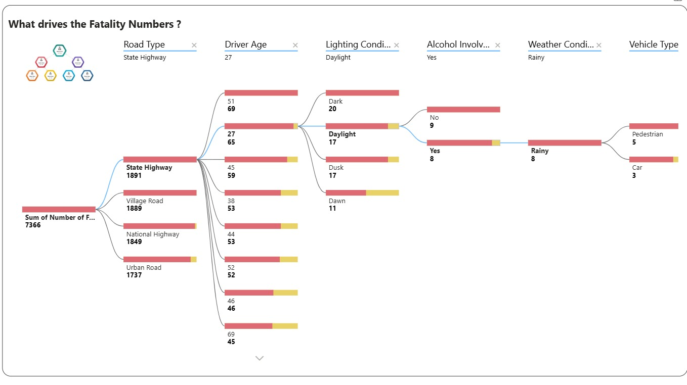

# 🚗 India Road Accident Analytics Dashboard — Power BI

An interactive Power BI dashboard analyzing road accident patterns, fatality trends, and safety insights across Indian states (2017–2020).




> 🔗 **[View Live Dashboard](https://app.powerbi.com/view?r=eyJrIjoiZTZmMDQ4ZDUtNTg1NC00NzliLWEzNTQtZDYyN2JmOGFhMGU2IiwidCI6ImRhZTA4MDk3LTgyNjAtNDk5Ni05MDY2LWZhZTExYmY3MWVhNiJ9)**

---

## 📌 Project Overview

This project provides a comprehensive visual analysis of road accident data in India, enabling stakeholders to explore accident severity, fatality drivers, weather impacts, and time-based patterns through an interactive, drill-through Power BI report.

---

## 🗂️ Data Sources

| File | Description |
|------|-------------|
| `India_Injury_Road_Accident_Fatality_2017-2020.csv.xlsx` | State-wise injury and fatality statistics (2017–2020) |
| `accident_prediction_india.csv` | Accident-level records with attributes like driver age, weather, lighting, road type, alcohol involvement |

---

## 📊 Dashboard Pages

### Page 1 — Accident Analytics Dashboard
- **KPI Cards**: Total Accidents, Total Fatalities, Average Speed Limit by Road Type
- **Line Chart**: Monthly casualty trend (identifies peak months)
- **Donut Chart**: Weather condition impact on fatalities (Rainy, Clear, Stormy, Hazy, Foggy)
- **Pie Chart**: Time-of-day accident severity distribution
- **State Slicer**: Filter all visuals by Indian state

### Page 2 — What Drives the Fatality Numbers?
- **Decomposition Tree**: Drill-down across Road Type → Driver Age → Lighting Conditions → Alcohol Involvement → Weather Conditions → Vehicle Type
- Highlights the highest-risk combination: **State Highway + Age 27 + Daylight + Alcohol Involved + Rainy + Pedestrian**

---

## 📐 Data Model

Three tables connected in Power BI:

```
India_Injury_Road_Acci...  (1)
         |
         * (many)
      Accidents  ←————→  accident_prediction_india
                  (many-to-many on City Name, Day of Week)
```

**Key tables and fields:**

- **Accidents**: Accident Severity, City Name, Day of Week, Driver Gender, Month, Number of Casualties, Number of Fatalities
- **accident_prediction_india**: Accident Location Details, Accident Severity, Alcohol Involvement, City Name, Driver Age, Driver Gender, Driver License Status, Lighting Conditions, Speed Limit, Vehicle Type, Weather Conditions
- **India_Injury_Road_Acci...**: Road Accidents during 2019, Accidents Per Lakh Population, Accidents per 10,000 Km of Road, Injury rates

---

## 🧮 DAX Measures

All DAX measures are documented in [`DAX_Measures.md`](./DAX_Measures.md).

| Measure | Description |
|---------|-------------|
| `Total Accidents` | Count of all accident rows |
| `Total-Fatalities` | Sum of fatality counts |
| `Fatality Rate (%)` | Fatalities as a % of total accidents |
| `Average Speed Limit` | Mean speed limit across records |
| `Overspeeding_Accidents` | Accidents where overspeeding was flagged |
| `Alcohol_Accidents` | Accidents where alcohol was involved |
| `Cause_Count` | Total rows with a non-blank cause value |

---

## ✨ Features

- **KPI Cards** with dynamic icons for quick metric visibility
- **Drill-through Navigation** between dashboard pages
- **State-level Slicer** for granular state-wise exploration
- **Decomposition Tree** for root cause analysis of fatalities
- **Dynamic Tooltips** for enhanced interactivity
- **Time-of-Day Analysis** using a pie chart across 5 peak time slots
- **Weather Impact Analysis** using a donut chart
- **Monthly Casualty Trend** line chart to identify seasonal patterns

---

## 🔍 Key Insights

- **March** records the highest number of casualties; **April** the lowest
- **State Highways** account for the highest fatalities (1,891), closely followed by Village Roads (1,889)
- **Rainy weather** is the most common condition in fatal accidents (28.9%)
- **Alcohol involvement** significantly amplifies fatality risk under daylight conditions
- **Pedestrians** are the most vulnerable vehicle type in high-risk scenarios
- **23:05** is the single highest-risk time slot (30.43% of severe accidents)

---

## 🛠️ Tools & Technologies

| Tool | Usage |
|------|-------|
| **Power BI Desktop** | Dashboard development and visualization |
| **DAX** | Custom measures and KPIs |
| **Power Query** | Data transformation and cleaning |
| **Excel / CSV** | Source data formats |

---

## 🚀 Getting Started

1. Clone this repository:
   ```bash
   git clone https://github.com/your-username/india-accident-analytics.git
   ```
2. Open `AccidentDashboard.pbix` in **Power BI Desktop**
3. If prompted, update the data source paths to match your local file locations
4. Refresh the data model and explore the dashboard

---

## 📁 Repository Structure

```
india-accident-analytics/
│
├── AccidentDashboard.pbix               # Power BI report file
├── data/
│   ├── India_Injury_Road_Accident_Fatality_2017-2020.csv.xlsx
│   └── accident_prediction_india.csv
├── assets/
│   └── dashboard_preview.png            # Dashboard screenshots
├── DAX_Measures.md                      # All DAX measures with documentation
└── README.md
```

---

## 🤝 Contributing

Pull requests are welcome. For major changes, please open an issue first to discuss what you would like to change.

---

## 📄 License

This project is for educational and analytical purposes. Data sourced from publicly available Indian road accident records.
